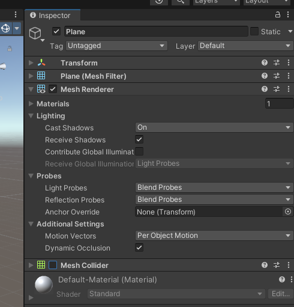
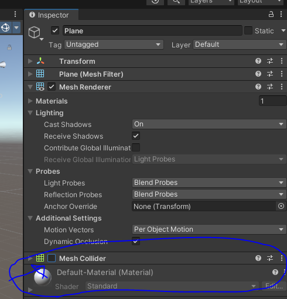

# 유니티 엔진이 동작하는 원리

## 코드는 재사용 되어야 한다!

### 상속하자!

상속: 부모의 특징을 자식이 다 상속받는다.  
예) 몬스터: 오크 (초록 피부 추가), 오크: 오크대장 (왕관 추가)

상속의 한계: 부모의 특정 특징만 사용하고, 필요 없는 부분을 제거 하는 경우 발생.  
예) 사람: 플레이어, 사람: npc (체력 제거, 공격력 등 물리 엔진 제거)  
-> 뭐가 공통이어야 하고 아닌지 판단하기 어려움, 추후에 부모를 수정하게 되면 자식도 다 수정해야 함

### 컴포넌트로 사용하자!

rigid body, mesh collider, lighting, 심지어 transform 까지 다 component라고 함.  
  
특징들의 집합을 받는 상속 대신 원하는 특징(컴포넌트)를 골라담자!

예) cube가 떨어질 수 있는 plane에 mesh collider라는 컴포넌트를 제거  
  
-> 큐브가 평면을 지나 계속 떨어짐 (컴포넌트 변경으로 간편하게 다른 Object로 변경이 가능)

## Monobehaviour

유니티 오브젝트는 기본적으로 Monobehaviour를 상속받아 유니티의 기본적인 기능들을 사용 가능  
예) 많이 쓰는 기능 BroadCasting: Dance()를 실행  
-> 유니티 월드 안에 Dance라는 기능이 있는 오브젝트들이 춤추기 시작 / 기능이 없다면 해당 명령 무시
